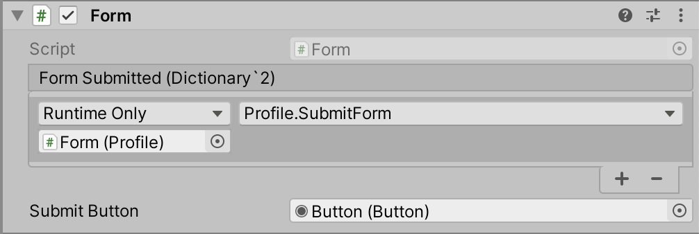

# Forms

> Components used to simplify the handling of form inputs in Unity.

[](https://www.npmjs.com/package/xyz.candycoded.form)

## Installation

### Direct Install

[Download latest `CandyCoded.Forms.unitypackage` or `CandyCoded.Forms.dll`](https://github.com/CandyCoded/Forms/releases)

### Unity Package Manager

<https://docs.unity3d.com/Packages/com.unity.package-manager-ui@2.0/manual/index.html>

#### Git

```json
{
  "dependencies": {
    "xyz.candycoded.forms": "https://github.com/CandyCoded/Forms.git#v1.1.0",
    ...
  }
}
```

#### Scoped UPM Registry

```json
{
  "dependencies": {
    "xyz.candycoded.forms": "1.1.0",
    ...
  },
  "scopedRegistries": [
    {
      "name": "forms",
      "url": "https://registry.npmjs.com",
      "scopes": ["xyz.candycoded"]
    }
  ]
}
```

## Usage

First create a class with the same field names (and data types) as the form.

```csharp
public class Profile
{
    public bool active;
    public string firstName;
    public string lastName;
    public int age;
}
```

Add a `Form` property to a MonoBehaviour for storing a reference to the `Form` component.

```csharp
[SerializeField]
private Form _form;
```

Populate the fields with exisiting values (if applicable).

```csharp
public void Start()
{

    _form.LoadFormValues(new Profile
    {
        active = true,
        firstName = "Scott",
        lastName = "Doxey",
        age = 36
    });

}
```

Data can also be loaded via a JSON `string` object.

```csharp
public void Start()
{

    _form.LoadFromJSON(jsonString);

}
```

Data can also be loaded via a `Dictionary<string, object>` object.

```csharp
public void Start()
{

    _form.LoadFormRawValues(new Dictionary<string, object>
      {
          { "active", true },
          { "firstName", "Scott" },
          { "lastName", "Doxey" },
          { "age", 36 },
      });

}
```

Create a submit event handler that takes `Dictionary<string, object>` as it's only property.

```csharp
public void SubmitFormObject(Dictionary<string, object> formRawValues)
{

    Debug.Log(formRawValues);
    Debug.Log(JsonConvert.SerializeObject(formRawValues));

}
```

Or a submit event handler that takes `string` as it's only property.

```csharp
public void SubmitFormJSON(string json)
{

    Debug.Log(json);

}
```

Attach that method to the form submitted event handler on the `Form` component (see screenshot below).

**Note:** A button can also be assigned to the form as the primary submit button (also see screenshot below).


